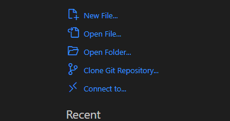
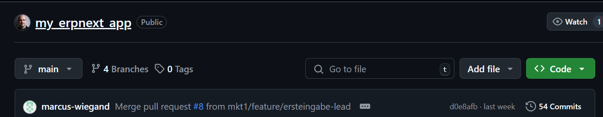
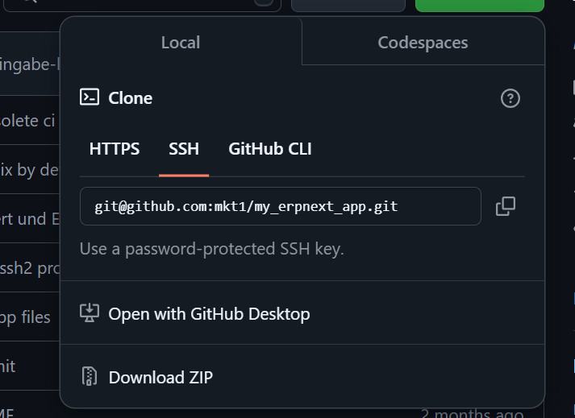
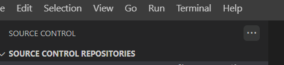
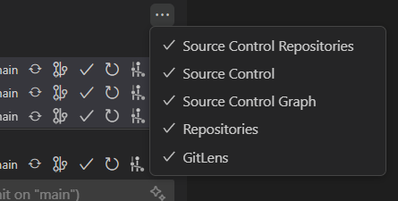
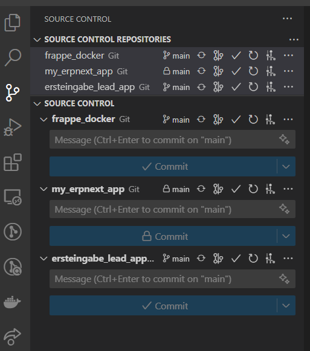
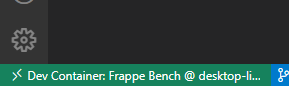
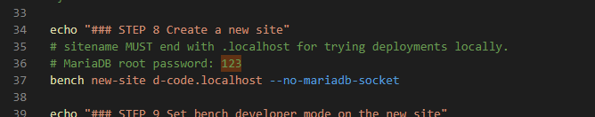
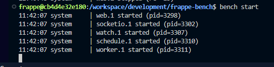

##### 2025 01 15 Read Me
# ERPNext GitHub

---

##### Voraussetzungen/Vorbereitungen:

- Docker Desktop
https://www.docker.com/products/docker-desktop/
- Git
https://git-scm.com/downloads/win
- VSC
https://code.visualstudio.com/download

bite immer schön auf aktuellste Version prüfen:
- docker 
- git

Auf dem lokalen Computer: Ordner erstellen, der dann der VSC-Workspace sein soll.
z.B. C:\Users\xxxxx\ERPNext

---

## Anlegen des VSC-Workspaces

### "frappe_docker" in VSC öffnen:

- VSC öffnen



- "Clone Git Repository" (1. Variante)
...oder Ctrl+Shift+P und dann "Git: Clone" aufrufen (2. Variante)
- (1) Link angeben:

```https://github.com/frappe/frappe_docker.git```

- (2) korrekten Ordner erstellen/auswählen
- Add to workspace

<br>
<br>

### "erpnext_infrastructur" in VSC öffnen:

- VSC öffnen






- "Clone Git Repository" ...oder Ctrl+Shift+P und dann "Git: Clone" aufrufen
- (1) Link angeben:

```git@github.com:schmidtundtoechter/erpnext_infrastructure.git```

- (2) korrekten Ordner erstellen/auswählen
- "add to workspace" 

<br>
<br>

Das ist eine Test-App:
### App "ersteingabe_lead_app" in VSC öffnen:

- VSC öffnen


- "Clone Git Repository" ...oder Ctrl+Shift+P und dann "Git: Clone" aufrufen
- (1) Link angeben:

```git@github.com:schmidtundtoechter/ersteingabe_lead_app.git```

- (2) korrekten Ordner erstellen/auswählen
- Add to workspace

<br>
<br>

Wir befinden uns jetzt in unserem neu angelegten Workspace und haben 3 Repositories erfolgreich geklont und in unserem Ordner vorliegen.

<br>
<br>

---

Jetzt Überordner, in dem diese 3 Ordner liegen, in VSC als Workspace öffnen.



Unter SOURCE CONTROL Im 3-Punkte-Menü "Repositories" ankreuzen.



→ Nun sollte man unter "SOURCE CONTROL" die 3 Repositories sehen können:



---

### ist das wirklich passiert und auch fertig?
Branch-Rule-Sets angegelegt für "erpnext_infrastructure" und "ersteingabe_lead_app"
→ das sollte vielleicht nochmal erläutert werden.

---

## Installation von ERPNext - Testsystem

- frappe_docker muss schön aktuell sein (!)
- Bash öffnen im frappe_docker - Verzeichniss (ganz normal auf dem Win-Rechner)

#### (1) clean...
- ../erpnext_infrastructure/dev_container_tools/frappe_docker-cleanrepository.sh
#### (2) prepare...
- ../erpnext_infrastructure/dev_container_tools/frappe_docker-prepare-devcontainer.sh

- neues vscode im frappe_docker wird automatisch gestartet
- reopen in container drücken, wenn die Frage kommt.
- unten links...



...sieht man immer, auf welchem System VSC überhaupt gerade läuft.

#### (3) reinstall...
frappe@cb4d4e32e180:/workspace/development$ ./frappe_docker-reinstall.sh
Dies legt ERPNext im Dev-Container an....



→ (falls man das MariaDB root Passwort braucht oder angeben soll)

#### Beachte: Ende des Scrips:
```
echo "### STEP 11 Start Frappe bench"
bench start

echo "### You can now login with user Administrator and the password you choose when creating the site. Your website will now be accessible at location http://d-code.localhost:8000"
```

Das bedeutet: 
Am Ende wird "bench start" asugeführt, d.h. ERPNext wird gestartet → der Befehl wird also nicht beendet.
Er kann natürlich - wie üblich - mit Ctrl-C beendet werden.
Irgendwann ist weiteres Warten also sinnlos (man sollte in der Bash eigentlich erkennen können, dass inzwischen "start bench" läuft).

ERPNext ist nun erfolgreich installiert und wurde bereits gestartet.

Browser öffnen...
http://d-code.localhost:8000

Login: Administrator
PW: admin

Wir haben jetzt unser eigenes Test-ERPNext 😍

---

Beenden durch Strg-C oder Beenden von VSC.

Neustart ERP:
```
cd frappe-bench
bench start
```

